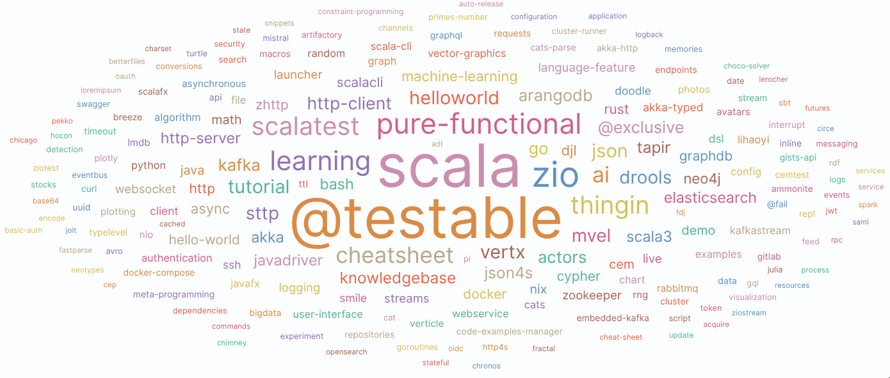
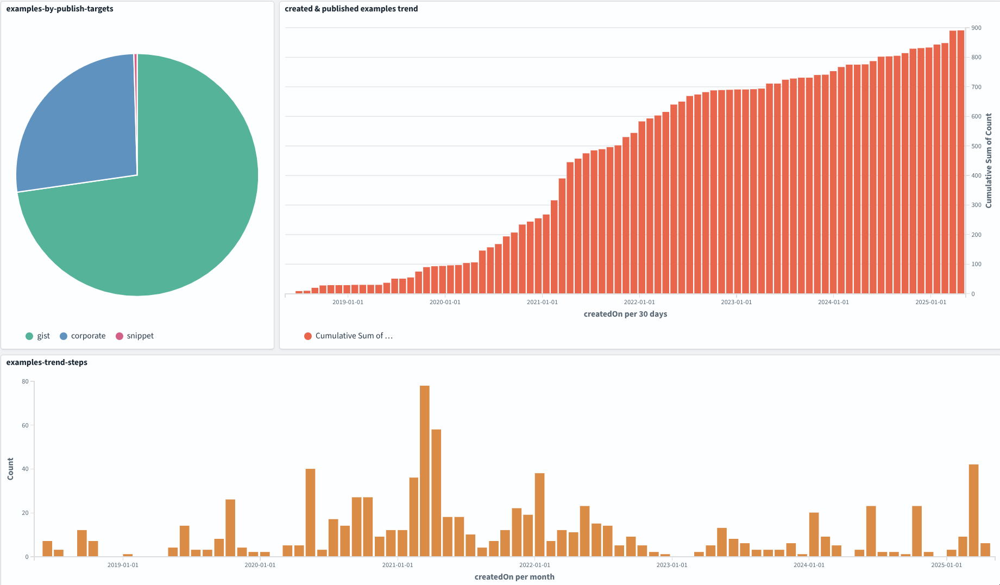

# [The rules for good code snippets](https://github.com/dacr/the-rules-for-good-code-examples)

Code snippets are essential; each snippet is most of the time
designed to focus on a particular feature/characteristic of a
programming language, a library, a framework or a behavior.
They help us to quickly test, experiment and remember how bigger
projects or at least some parts of them are working. They can even
be used as quick proofs of concept.

Learning or remembering is much quicker when you have at your disposal
your own set of snippets. This set of snippets is a **knowledge asset**,
we must become aware of its value for us but also from a project team or
company point of view. Any newcomer on a project will have a faster learning
curve if he/she has access to a set of snippets that capture the essence
of the project.

Nowadays, with all the progress made on Artificial Intelligence, this 
asset is even becoming more and more important as it can be used for
model training or fine-tuning purposes!



With some simple rules and a little discipline, you can make your snippets quite easy
to manage and share. Let's [review those rules](#simple-rules-for-good-code-snippets)
and how I'm [following them with dedicated software](#experience-returns) in a second step.

## Simple rules for good code snippets

- [**One purpose rule**](#one-purpose-rule)
- [**One file rule**](#one-file-rule)
- [**Easy-to-run rule**](#easy-to-run-rule)
- [**Self-describing rule**](#self-describing-rule)
- [**Security and confidentiality rule**](#security-and-confidentiality-rule)
- [**Manageable and shareable rule**](#manageable-and-shareable-rule)

When writing source code snippets, try to take into account the maximum
number of those rules to implement the best possible snippets.

### One purpose rule

**A good code snippet has one purpose**, such as learning something, writing a quick proof of concept,
automating a task, keeping the overall design principles of a project,
testing some programming language feature, ...

The underlying goal is to speed up the reminding process. If you come back several months, years on
a given snippet, you'll be able to quickly understand what it does and how it works.

A NIX regex snippet: The purpose is to quickly illustrate how regex works in the NIX language
```nix
let
  results = builtins.split "<([^>]+)>" "John Doe <john.doe@example.com>";
in with builtins; {
  first_matching_1 = (head (head (tail results))) ;
  first_matching_2 = (elemAt results 1) ;
}
```

### One file rule

**A good code snippet is just one file**. A single file with a meaningful directory tree and naming
helps a lot to keep the complexity under control as well as it enhances the developer experience once
the snippet has been shared. The directory tree can be used to group snippets by topic, by language,
by technology stack, ... while the filename synthesizes their purpose.

A bash snippet stored in a file named `bash-date-iso8601-formatted.sh`,
just from the filename we know it is about how to generate iso8601 dates
from the bash shell:
```bash
date -Is   # not GMT
date -u +"%Y-%m-%dT%H:%M:%SZ"
date -u +"%Y-%m-%dT%H:%M:%S.%3NZ"
```

### Easy-to-run rule

**A good code snippet is easy to run**, typically from the command line as a script or
within a Read-Eval-Print-Loop (REPL) session. It also means you will have to provide
all the necessary information to run it. When available the REPL is great to
interactively design or test your snippet.

A Scala snippet executed from a REPL session which illustrates how to use the [java data faker][faker] library:
```
$ scala-cli --dep com.github.javafaker:javafaker:1.0.2
Welcome to Scala 3.6.4 (23.0.1, Java OpenJDK 64-Bit Server VM).
Type in expressions for evaluation. Or try :help.

scala> val faker = new com.github.javafaker.Faker()
     |
     | val appName = faker.app.name
     | val author = faker.name.name
     | val email = faker.internet.emailAddress
     | val company = faker.company.name
     | val companyURL = faker.company.url
     | val country = faker.country.name
     |
     | println(s"""'$appName' an application By $author / $email""")
     | println(s"""'$company' / $country/ $companyURL""")
'Namfix' an application By Tamala Jacobi / joie.sporer@yahoo.com
'Hansen-Yost' / Turkmenistan/ www.macejkovicblickandblanda.co
```

The same snippet made executable from the command line:
```
$ ./data-fake.sc
'Gembucket' an application By Thad Deckow II / londa.quitzon@hotmail.com
'Goodwin, Cremin and Koss' / Israel/ www.watersgerholdandnicolas.com

$ cat data-fake.sc
#!/usr/bin/env scala-cli
//> using scala "3.6.4"
//> using dep "com.github.javafaker:javafaker:1.0.2"
val faker = new com.github.javafaker.Faker()
val appName = faker.app.name
val author = faker.name.name
val email = faker.internet.emailAddress
val company = faker.company.name
val companyURL = faker.company.url
val country = faker.country.name
println(s"""'$appName' an application By $author / $email""")
println(s"""'$company' / $country/ $companyURL""")

```

The previously shown snippet shows that there is some contextual information provided to
make it easy to run :
- **required execution runtime**
  - `scala-cli` is the runtime to use
- **needed software dependencies**
  - `scala 3.6.4` is used (and automatically downloaded)
  - `com.github.javafaker:javafaker:1.0.2` is resolved and downloaded (automatically from maven central)

As just shown, the best developer experience is achieved when you use a technology stack which
is able to **resolve and load dependencies at runtime**. Then you will have
just one file for everything. This is the case at least for :
- Scala : [scala-cli][scl] with the `//>` special comment syntax
- Rust : [rust-script][rs] with the `// cargo-deps :` or `//!` special comment syntaxes
- Java : [jbang][jbang] with the `//DEP` special comment syntax

You can also use a [shebang][shebang] to make your snippet directly executable
while giving to the reader the information about how it is executed.

### Self-describing rule

**A good code snippet describes by itself what it does**. When it makes sense, design your snippet
to make its execution self-describing. This is quite simple if you **use a unit test framework**
as most of them can generate a report on standard output.

A Scala snippet execution showing the behavior of the [upickle][upickle] library:
```
Run starting. Expected test count is: 6
JsonUpickleCookBook:
upickle
- should deserialize json array strings (36 milliseconds)
- should deserialize scala case classes ? (7 milliseconds)
- should deserialize scala case classes with optional field? default value is supported (3 milliseconds)
- should deserialize scala case classes with optional field? (3 milliseconds)
- should deserialize scala list (0 milliseconds)
- should provide an AST (13 milliseconds)
Run completed in 194 milliseconds.
Total number of tests run: 6
Suites: completed 1, aborted 0
Tests: succeeded 6, failed 0, canceled 0, ignored 0, pending 0
All tests passed.
```

So when executed, the output describes exactly what it does, and even more, as this is
unit tests based, it will fail until you gave the right implementation!
Or until you've understood what's going on ;)

### Security and confidentiality rule

** A good code snippet takes care of security and confidentiality**. It should not contain any
sensitive information, and should not be able to access any sensitive information.

Some good practices related to security and confidentiality :
- **No secrets** (tokens, passwords, passphrases, cryptographic keys, ...)
  - Use environment variables to inject secrets if needed
- **No sensible data** (IP addresses, usernames, internal URL, ...)
  - Use environment variables to inject sensible data
- **No sensible code** in snippets you plan to share
  - Stay as generic as possible
  - Consider shared snippets as learning materials or basic tools
- Always keep in mind **trademarks, copyrights, licenses**
  - Really take care with copy/paste content from anywhere
  - Avoid the use of internal AI assistant if you plan to share the snippet

### Manageable and shareable rule

**A good code snippet comes with meta-data** typically used to identify it uniquely, 
to describe how to share it, to add license information, description keywords, ...

Why? Because once you or your team have written hundreds of snippets, you'll quickly need to
industrialize their life cycle. You'll need to find solutions for :
- how to search through your snippets?
- how to share them? Publicly or internally?
- how to check their execution status?
- how to manage change history?
- how to let people react over them?
- ...

In relation to the [one-file rule](#one-file-rule) the right approach is to add meta-data
as comments directly in the header of the snippet file. It enables resilience and simplicity.

Snippet meta-data header example, coming from my chosen approach : 
```
// summary : take a look into models zoo
// keywords : djl, machine-learning, tutorial, detection, ai, zoo, @testable
// publish : gist
// authors : David Crosson
// license : Apache License Version 2.0 (https://www.apache.org/licenses/LICENSE-2.0)
// id : f6b25f1c-2d29-4cdb-a030-f7dbb3b94e96
// created-on : 2022-03-09T18:41:39+01:00
// managed-by : https://github.com/dacr/code-examples-manager
// run-with : scala-cli $file
```

Once you've achieved this, you will discover that you are currently building a knowledge base,
 which can be automatically processed by dedicated software.

Let's take a look at my experience returns and the dedicated software I'm using to achieve all of this. 

## Experience returns

I wrote my first "good" snippet back in 2018 ([Fully asynchronous http client call with JSON response using akka-http](https://gist.github.com/dacr/50b74b837008af547fd44e00f9d47944)
and now 7 years later, I've a data set made of almost 1300 snippets (almost 1000 are publishable).
- All my personal snippets are stored in a private GIT repository
- All my team snippets are stored in a shared GIT repository
- Almost everything is managed by a dedicated software called [code-examples-manager][cem] :
  - publishes/synchronizes on [GitHub gists][dacr-gists] and [Gitlab snippets][dacr-snippets]
  - generates and synchronizes a summary of [the published snippets knowledge base][dacr-gists-overview]
  - executes all executable snippets to check their states and if some maintenance is needed
  - check global snippets coherency and report various statistics
- A tool coded as a snippet ([cem-tool.sc](https://gist.github.com/dacr/f25da8222b2ac644c3195c5982b7367e)) is used to feed an opensearch search engine
  - Dashboard with various statistics,
  - Snippets execution trends, ...
- Stable set of meta-data keywords, see [code-examples-manager][cem] for more information
- Such a discipline over the years unlocks me various opportunities
  - Elasticsearch/opensearch training with a part based on this dataset :)
  - Various AI-related experiments again with this dataset :) 
- I've started with what I called first code examples, now it can be anything, so I use now the 'snippet' terminology
  - snippets as documentation,
  - snippets as configuration files,
  - snippets as dedicated dataset (csv content for example), 
  - ...



[scl]: https://scala-cli.virtuslab.org/
[rs]: https://rust-script.org/
[jbang]: https://www.jbang.dev/
[amm]: https://ammonite.io/
[cem]: https://github.com/dacr/code-examples-manager
[dacr-gists-overview]: https://gist.github.com/dacr/c071a7b7d3de633281cbe84a34be47f1
[dacr-gists]: https://gist.github.com/dacr
[dacr-snippets]: https://gitlab.com/users/crosson.david/snippets
[shebang]: https://en.wikipedia.org/wiki/Shebang_(Unix)
[scalatest]: https://www.scalatest.org/
[snippets]: https://gitlab.com/explore/snippets
[gists]: https://gist.github.com/discover
[strops]: https://gist.github.com/dacr/3b592b9f9ed0b88a7236503f075b8f89
[upickle]: https://github.com/lihaoyi/upickle
[faker]: https://github.com/datafaker-net/datafaker